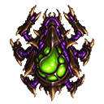
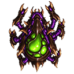
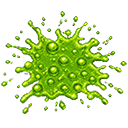
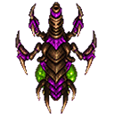
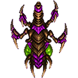
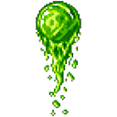
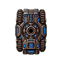
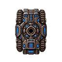
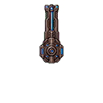
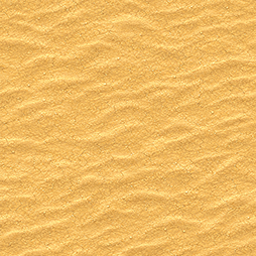

# AI Usage

AI was used to handle problems occured while developing the game. No code was generated by AI. It was purely used to get suggestions and possible fixes.

## Coding

In the following table you can see the prompt used and also a summary of the outcome.

|Prompt|Summary|
|----------|----------|
|I want to register and unregister event listeners in JavaScript at specific places in my code. Task: Please identify the problem why unregistering the event listeners is not working in this case. Suggest a possible solution and explain it. Keep it short and focus on the important things. <code>registerListeners() { window.addEventListener("keydown", this.handleKeyDown.bind(this)); window.addEventListener("keyup", this.handleKeyUp.bind(this)); this.unregisterListeners(); } unregisterListeners() { window.removeEventListener("keydown", this.handleKeyDown.bind(this)); window.removeEventListener("keyup", this.handleKeyUp.bind(this)); }</code>|The AI identified the problem: The problem is that every call to bind() creates a new function object. The AI suggested to hold a reference to the bound function in a variable. <code>constructor() { this.boundHandleKeyDown = this.handleKeyDown.bind(this); this.boundHandleKeyUp = this.handleKeyUp.bind(this); }</code>|

## Math

|Prompt|Summary|
|----------|----------|
|Explain to me in simple steps how I can convert degrees to a direction vector, where 0° result in a direction vector pointing upwards. (0° -> [0, -1])|The AI suggested to swap sine and cosine and negate the y-component: 1. Convert degrees to radians 2. Compute x and y x = sin(radians) y = -cos(radians) 3. Combine them [sin(radians), -cos(radians)]|
|I know I can convert a vector to a rotation in degrees with Math.atan2(x, -y) * 180 / Math.PI. Explain to me the math behind it in simple steps. Keep it short and simple.|The AI explained the math: A vector (x, y) points in some direction. atan2(a, b) returns the angle whose horizontal and vertical components match (b, a). Unlike plain atan, it correctly identifies all four quadrants. Normally, atan2(y, x) measures from the positive x-axis. Using atan2(x, -y) swaps the axes and flips y, so: (0, -1) → 0° (up) (1, 0) → 90° (right) (0, 1) → 180° (down) (-1, 0) → -90° (left) atan2 returns radians, so multiplying by 180 / Math.PI converts radians to degrees.|

## Assets

|Prompt|Summary|
|----------|----------|
|I want you to create a sprite based on that. The image should have a one colored background, that can easily made transparent for a game. It should be 64px width and 64px height. It should be a unit, that can explode. It should have some kind of venom tank which is in green color. Keep it in the same pixelated style as the provided images. The perspective should be top down, so that the unit is directly seen from above and not in an isometric perspective.  Now make a variation of the picture for a movement animation. It should only be slightly different, where the legs have a different position in order to use it in combination with the original to make a simple walking animation.  Now make a death sprite for that enemy. It should be just a splatter of green alien slime on the ground. Make the background pink, so that it is easier to make the background transparent.  Without the alien parts. Only green slime.|    |
|I want you to create a sprite based on that. The image should have a one colored background, that can easily made transparent for a game. It should be 64px width and 64px height. It should be a unit, that can shoot green slime balls. It should be slim. Keep it in the same pixelated style as the provided images. The perspective should be top down, so that the unit is directly seen from above and not in an isometric perspective.  Don't add the slime ball to it. Keep the rest.  Now make a variation of the picture for a movement animation. It should only be slightly different, where the legs have a different position in order to use it in combination with the original to make a simple walking animation.  Now create a sprite with only the slime ball with the trail.|    |
|I want you to create a sprite based on that. The image should have a one colored background, that can easily made transparent for a game. It should be 64px width and 64px height. It should be a tank in dark grey colors. Whith azure blue lights. The ratio of the width and height of the tank should by 4x6. Make the tank without a gun and a turret. The gun should be interchangable. The socket for the gun is in the exact middle of the tank. Keep it in the same pixelated style as the provided images. The perspective should be top down, so that the unit is directly seen from above and not in an isometric perspective.  Keep the overall style of the tank, but make it more obvious where the front is.  Remove the arrow shape at the front and do it differently.  Now make a variation of the picture for a movement animation. The chains of the tank should move a little bit, in order to use it in combination with the original to make a simple driving animation.|  |
|Now make a laser turret for the tank. It should be rotatable from the exact middle of the tank. The laser gun should have 2 leading blue lights left and right. The laser should be slim, but reaching over the full length of the tank. The laser gun should be straight. The laser can shoot one beam from the middle of the gun. Show only the gun on the picture. I should be attachable on the tank.  Keep the gun as it is and only remove the lower part. Also redesign the turret of the laser gun. It should not have a socket.||
|In the style of the provided images, create a tileable background. It should be a desert in the sun. It should have some depth, but don't add obstacles or hills.  Make it lighter. With more soft sand. Like in a desert with dunes.||