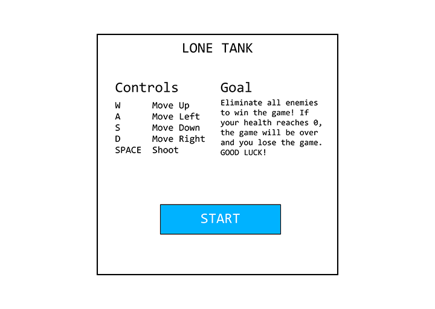
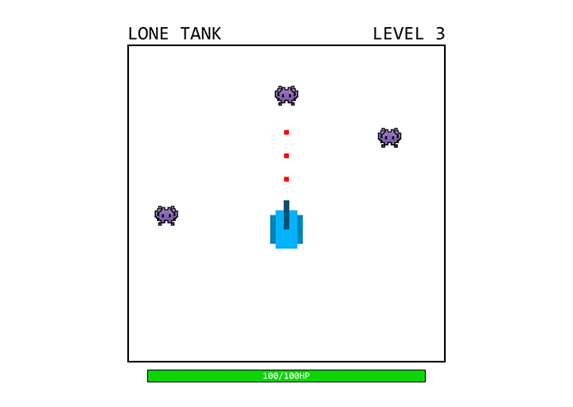
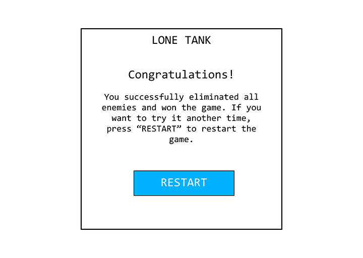
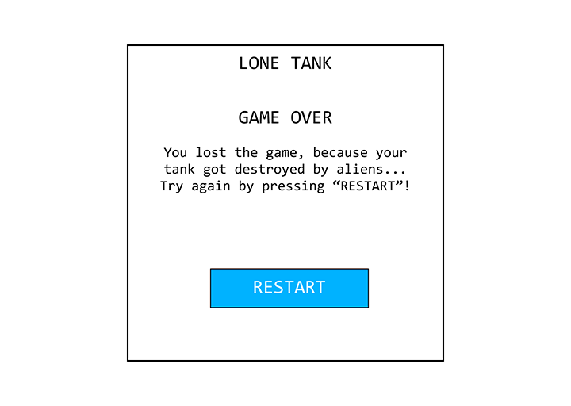

# LONE TANK

Lone Tank is a game about a tank deployed on the wrong planet by accident. The goal is to survive against alien enemies by successfully eliminating them.

## Game Logic

Eliminate all spawning enemies to win the game. If you got hit by an enemy, your health will decrease depending on the strength of the enemy attack. If the life of your tank reaches 0, the game will be over. Move the tank in any direction to dodge enemy attacks. Shoot them until their health reaches 0 to eliminate them. GOOD LUCK!

## Player Controls

Use the keyboard to control the tank.

|Key|Action|
|:----------:|----------|
|<kbd>W</kbd>|Drive the tank forward|
|<kbd>A</kbd>|Rotate the tank counter clockwise (left)|
|<kbd>S</kbd>|Rotate the tank clockwise (right)|
|<kbd>D</kbd>|Drive the tank backward|
|<kbd>Mouse1</kbd> <kbd>SPACE</kbd>|Shoot in the direction of the mouse cursor|

## Additional Information

### Tools Used

[Figma](https://www.figma.com/)\
[Visual Studio Code](https://code.visualstudio.com/)\
[Adobe Photoshop](https://www.adobe.com/products/photoshop.html)\
[ChatGPT (GPT-5.6 Sol)](https://chatgpt.com/)

### Resources Used

[MDN Web Docs](https://developer.mozilla.org/en-US/)\
[W3Schools](https://www.w3schools.com/)\
[StackOverflow](https://stackoverflow.com/)\
[Micro5 @ Google Fonts](https://fonts.google.com/specimen/Micro+5?preview.script=Latn) - [OFL License](https://fonts.google.com/specimen/Micro+5/license?preview.script=Latn)\
[sci-fi-laser-blaster-shot-6 by flyingsaucerinvasion](https://freesound.org/s/615812/)
-- License: Attribution 3.0\
[Hitmarker Sound Effect.mp3 by aruscio28](https://freesound.org/s/322640/)
-- License: Creative Commons 0\
[bucket_splash.mp3 by minian89](https://freesound.org/s/195955/)
-- License: Creative Commons 0\
[Tank or Tower Turret Moving and Turning by qubodup](https://freesound.org/s/171657/)
-- License: Creative Commons 0

### AI Usage

AI was purely used to tackle problems in coding and math. Also AI was used to generate assets.\
Every prompt used is documented in the [AI-USAGE.md](./AI-USAGE.md) file.

### Wireframes

